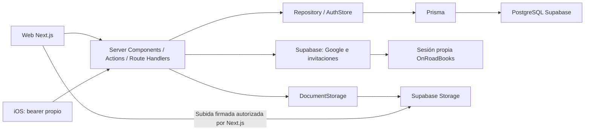

# OnRoadBooks: inventario de Supabase y plan de migración

Fecha: 2026-09-19. Repositorio: `onroad-books`. Commit auditado: `60aaa75192b498eb87766134877f2663b3df0177`.

**Resultado actualizado: fases 2–5 completadas para desarrollo.** Neon está provisionado, su esquema coincide con el origen recuperado (incluido el orden histórico de dos enums) y contiene 44 registros verificados en 20 tablas. Respaldo cifrado restaurado y mapa de tres identidades Google guardado. Drizzle implementa los 60 métodos de datos y cuentas y puede seleccionarse con `DATA_SOURCE=neon`; producción conserva su backend anterior. Auth.js ya está implementado y probado, incluidas las tres identidades Google importadas; Google OAuth real ya funciona en localhost con Neon Development y la invitación real fue entregada y certificada; el preview protegido está desplegado y en verificación. R2 está implementado y certificado contra Cloudflare real, con bucket privado, credencial restringida y limpieza de partes temporales; su activación en producción espera el corte coordinado. Inventario actualizado: un bucket privado y cero objetos/documentos. Ver [fase 4](phase-4-data-copy.md), [fase 5](phase-5-drizzle-repository.md), [fase 6](phase-6-authjs.md), [fase 7](phase-7-r2-storage.md) y [fase 8 / preparación del corte](phase-8-services-and-cutover-preparation.md) y [fase 9 / preview](phase-9-preview-verification.md). Las observaciones iniciales de falta de acceso que siguen abajo son históricas y quedan actualizadas por ese informe.

## Decisión de arquitectura confirmada

El término **autenticación híbrida** describe únicamente el estado actual encontrado en el repositorio. No es la arquitectura de destino. La decisión es que **Supabase salga completamente de OnRoadBooks** al terminar la migración, incluido Supabase Auth; no se mantendrá como segundo proveedor de identidad ni como respaldo permanente.

El estado híbrido apareció por evolución del producto: la autenticación original de OnRoadBooks se creó con scrypt y una cookie firmada cuando no existían equipos, Google ni correo. Más tarde se añadió Supabase para verificar Google y para generar/verificar invitaciones, mientras los usuarios, roles, negocios, permisos y la sesión efectiva de OnRoadBooks siguieron siendo propios. Esto creó dos capas de identidad y dejó un costo/dependencia que ahora se eliminará.

Destino de autenticación aprobado:

| Función | Destino sin Supabase |
| --- | --- |
| Email y contraseña | Auth.js Credentials validando los hashes scrypt existentes |
| Google | Provider Google de Auth.js con credenciales OAuth propias |
| Sesión web | Sesión Auth.js ligada al `User.id` existente y revalidada contra la base |
| Invitaciones | Token aleatorio de un solo uso, guardado como hash con expiración y enviado por el servicio de correo de OnRoadBooks |
| Usuarios, roles y permisos | Tablas y reglas propias en Neon; nunca metadata de Google |
| Móvil | Bearer/handoff compatible durante la transición y posteriormente ligado a la misma identidad Auth.js |
| Borrado y revocación | Sesiones/cuentas propias; ninguna llamada administrativa a Supabase |

La coexistencia descrita en las fases es solo una medida temporal de migración y rollback. Después de verificar Auth.js, se reemitirán las invitaciones pendientes que todavía dependan de enlaces Supabase, se revocarán las sesiones Supabase, se retirarán sus variables/imports/paquetes y se podrá cancelar el servicio una vez migradas también la base y Storage.

## Alcance y evidencia

Se inventariaron los 550 archivos versionados y se rastrearon referencias, imports y consumidores en `src/`, `prisma/`, `scripts/`, `mobile/`, configuración, CI, documentación y lockfile. Se revisaron las implementaciones de datos, autenticación, permisos, documentos, jobs y despliegue. Los archivos generados y `node_modules` no se cuentan como implementación propia; se consultaron las guías locales de Next.js sobre seguridad de datos y Proxy.

Se inspeccionaron **nombres de variables y hostnames**, sin copiar valores secretos de `.env` o `.env.local`. La configuración local apunta al proyecto Supabase `uznuvzeghgwygpxjhqdz`. Esto identifica la configuración de este checkout, no certifica qué variables usa el despliegue actual.

La consulta de proyectos del conector devuelve Bookliz y RBTGenius, no OnRoadBooks. No se consultaron los datos de esos proyectos. La consulta PostgreSQL de solo lectura mediante la conexión de este repositorio, una vez habilitado el acceso de red, responde:

```text
FATAL: (ENOTFOUND) tenant/user postgres.uznuvzeghgwygpxjhqdz not found
```

La petición de solo lectura a `/storage/v1/bucket` del hostname configurado falla con `ENOTFOUND`. Esto **no demuestra que la base esté vacía ni que el proyecto haya sido eliminado**. Puede haber una configuración obsoleta o una infraestructura a la que esta sesión no tiene acceso.

Por tanto, las tablas, constraints y servicios que se describen como existentes son los **declarados/consumidos en el repositorio**. Quedan sin verificar el schema desplegado, número de filas, objetos de Storage, identidades, proveedores habilitados, SMTP, políticas remotas, extensiones, publicaciones, cron y funciones creadas fuera del repositorio. No se inventa un inventario de archivos remotos.

Documentos complementarios:

- [Schema, enums, FK, índices, CHECK y mapa de consultas](supabase-schema-and-queries.md).
- [Inventario JSON de consultas, imports, transacciones y consumidores](supabase-query-inventory.json): 313 expresiones de consulta/SQL operativo en aplicación/scripts/seed, de las cuales 205 pertenecen al adaptador de producción. Contiene el texto de cada llamada y su ubicación, sin datos reales ni credenciales.

## 1. Arquitectura actual y servicios utilizados

OnRoadBooks ya tiene dos abstracciones útiles: `Repository`/`AuthStore` para datos y `DocumentStorage` para archivos. La aplicación no consulta las tablas con PostgREST: utiliza **Prisma conectado a PostgreSQL**. Los SDK de Supabase se usan para Auth y Storage.

| Servicio | Uso encontrado | Evidencia principal |
| --- | --- | --- |
| PostgreSQL alojado en Supabase | Persistencia de producción con Prisma; alternativa JSON local | `src/lib/db/index.ts`, `prisma/schema.prisma` |
| Supabase Auth | Google OAuth, intercambio de ID token, verificación de invitaciones, envío de invitaciones y eliminación administrativa de identidades | `src/lib/supabase/`, `src/app/api/auth/` |
| Autenticación propia | Registro/email-contraseña scrypt, cookie HMAC, bearer móvil, roles y permisos | `src/lib/auth/`, `src/lib/roles.ts` |
| Supabase Storage | Documentos privados; subida directa web con firma, fallback servidor, descargas firmadas y eliminación | `src/lib/storage/supabase.ts` |
| Data API/PostgREST | No se consume para tablas de negocio; el hardening revoca acceso | `prisma/harden-data-api.sql` |
| RLS | Habilitado por script para las 20 tablas, sin políticas de acceso de negocio declaradas | `prisma/harden-data-api.sql` |
| Realtime | Sin llamadas `.channel()`, `postgres_changes` o subscriptions de Supabase en el código propio | Búsqueda de fuentes; SDK transitivo no prueba uso |
| Edge Functions | Sin invocaciones `.functions.invoke()` ni directorio de funciones/configuración Supabase | Búsqueda de fuentes y archivos |
| RPC/PostgreSQL functions/triggers propios | Sin `.rpc()`, funciones persistentes o triggers propios definidos en las migraciones | Migraciones y adaptador Prisma |
| Cron | Vercel Cron llama a Next.js diariamente a las 08:00 UTC; GitHub Actions ejecuta backup a las 08:10 UTC; también existe configuración launchd | `vercel.json`, `.github/workflows/backup.yml`, `scripts/launchd/` |
| Webhooks | Stripe entra por un Route Handler; alertas pueden salir por Resend o webhook genérico | `src/app/api/stripe/webhook/route.ts`, `src/lib/operations.ts` |

La ausencia en el código no permite descartar recursos configurados directamente en Supabase. La fase 1 remota debe cerrar esa diferencia.



## 2. Dependencias e imports completos

Dependencias directas en `package.json`:

| Paquete | Versión declarada y resuelta | Uso |
| --- | --- | --- |
| `@supabase/ssr` | `0.12.5` | Cliente de Auth con cookies server-side |
| `@supabase/supabase-js` | `2.112.4` | Admin Auth, Storage servidor/navegador y tipos |

Transitivas en `package-lock.json`: `@supabase/auth-js`, `functions-js`, `postgrest-js`, `realtime-js`, `storage-js` en `2.112.4`; `@supabase/phoenix` en `0.4.5`. No se encontraron imports directos de estas transitivas. Su instalación no significa que la aplicación utilice todos esos servicios.

Los ocho imports del SDK en código propio:

| Archivo y línea | Import |
| --- | --- |
| `src/lib/supabase/server.ts:3` | `createServerClient` de `@supabase/ssr` |
| `src/lib/supabase/admin.ts:3` | `createClient` de `@supabase/supabase-js` |
| `src/lib/storage/supabase.ts:3` | `createClient` de `@supabase/supabase-js` |
| `src/components/documents/document-uploader.tsx:278` | Import dinámico de `@supabase/supabase-js` |
| `src/lib/auth/complete-supabase-sign-in.ts:4` | Tipo `User` de `@supabase/supabase-js` |
| `src/app/api/auth/callback/route.ts:11` | Tipo `EmailOtpType` de `@supabase/supabase-js` |
| `scripts/certify-production-storage.ts:4` | `createClient` de `@supabase/supabase-js` |
| `scripts/certify-production-invitations.ts:4` | `createClient` de `@supabase/supabase-js` |

No hay Auth.js, Drizzle ni cliente R2 instalado como dependencia directa. La migración incluye además reemplazar `@prisma/client`, `prisma`, el cliente generado, scripts Prisma y sus referencias de empaquetado, una vez que no tengan consumidores.

### Clientes identificados

- **Navegador:** `document-uploader.tsx` crea un cliente efímero para `uploadToSignedUrl`. Deshabilita persistencia, refresh automático y detección de sesión en URL. No hay `createBrowserClient` ni proveedor global de sesión Supabase.
- **Servidor SSR:** `createSupabaseServerClient()` en `src/lib/supabase/server.ts`; integra `cookies().getAll/setAll`. Lo usan Google, callback, aceptación de invitaciones y revocación durante eliminación de cuenta. El comentario que lo limita a Google está desactualizado.
- **Admin/secret:** `src/lib/supabase/admin.ts` crea clientes con `SUPABASE_SECRET_KEY`, sin persistencia ni refresh. Envía invitaciones y busca/elimina identidades por email, paginando hasta 50 páginas de 200 usuarios.
- **Storage privilegiado:** `SupabaseDocumentStorage` crea clientes con la misma secret key para firmas, metadatos y bucket healthcheck; usa también REST directamente para bytes y borrado.
- **Scripts:** los dos `certify-production-*` anteriores crean clientes admin y públicos para probar acceso. Son pruebas con escrituras/cleanup; no se ejecutaron contra producción.
- **Proxy/middleware:** `src/proxy.ts` no instancia Supabase. Comprueba presencia de la cookie propia; la comprobación real de sesión/usuario se hace en servidor. No hay middleware Supabase de refresh.
- **iOS:** no hay SDK Supabase; consume `/api/mobile/*` con bearer propio y usa el login web para Google.

## 3. Variables de entorno y configuración

| Variable | Consumo/propósito | Tratamiento de migración |
| --- | --- | --- |
| `NEXT_PUBLIC_SUPABASE_URL` | Auth SSR, subida web, healthcheck; fallback admin/scripts | Conservar durante coexistencia; quitar al final |
| `NEXT_PUBLIC_SUPABASE_PUBLISHABLE_KEY` | Auth SSR, subida web, healthcheck y certificaciones | Pública; quitar cuando no existan consumidores |
| `NEXT_PUBLIC_SUPABASE_ANON_KEY` | Solo fallback del uploader web | Uso de compatibilidad en código; no encontrada como clave local configurada |
| `SUPABASE_URL` | Storage servidor; URL preferida de admin y fallback Auth | Privada por ubicación, aunque la URL no sea un secreto |
| `SUPABASE_PUBLISHABLE_KEY` | Fallback Auth SSR/certificaciones; presente en `.env.local` | No sustituye la secret key |
| `SUPABASE_SECRET_KEY` | Admin Auth y acceso privilegiado a Storage | Exclusivamente servidor; conservar hasta finalizar cleanup/migración |
| `SUPABASE_STORAGE_BUCKET` | Bucket, fallback `documents` | Preservar mapeo de bucket y paths |
| `DATABASE_URL` | Prisma runtime | Ya existe; no cambiar de destino prematuramente |
| `DIRECT_URL` | Prisma migrations y scripts de backup/restauración | Ya existe; mantener conexión de migración adecuada para Neon |
| `DATA_SOURCE` | `postgres` selecciona Prisma si URL válida; resto cae a JSON | Introducir selector explícito sin alterar el default de producción |
| `DOCUMENT_STORAGE` | `supabase` o almacenamiento local | Añadir `r2`; evitar fallback silencioso en producción |
| `AUTH_SECRET` | HMAC de cookie, bearer, handoff móvil y ticket de subida | Ya existe y tiene usos adicionales a Auth.js; no rotarlo incidentalmente |
| `NEXT_PUBLIC_GOOGLE_CLIENT_ID` | Habilita botón Google y se usa en healthcheck | Revisar junto con futuras credenciales server-side de Google |
| `NEXT_PUBLIC_APP_URL` | Origen público e invitaciones/integraciones | Preservar dominio público |
| `PLATFORM_ADMIN_EMAILS` | Administradores de plataforma, distinto de rol `ADMIN` | Conservar y revalidar server-side |

`SUPABASE_SERVICE_ROLE_KEY` no aparece como variable consumida: el nombre real de la credencial privilegiada es `SUPABASE_SECRET_KEY`. No renombrarla basándose en un ejemplo genérico.

En `.env.local` también hay variables de integración `POSTGRES_DATABASE`, `POSTGRES_HOST`, `POSTGRES_PASSWORD`, `POSTGRES_PRISMA_URL`, `POSTGRES_URL`, `POSTGRES_URL_NON_POOLING` y `POSTGRES_USER`. No hay lecturas explícitas de ellas en el código de aplicación/scripts revisado; no asumir que Next.js las convierte en `DATABASE_URL`. No se leyeron variables remotas de Vercel/GitHub.

Configuración adicional afectada: CSP permite `*.supabase.co` y `auth.onroadbooks.com` en `next.config.mjs`; healthcheck exige Storage Supabase en producción y tres variables de Auth; build de Vercel ejecuta migraciones Prisma/hardening/diff; backups utilizan `DIRECT_URL || DATABASE_URL`.

Destino propuesto: `DATABASE_URL`, conexión directa de migraciones, `AUTH_SECRET`, `AUTH_URL`, credenciales Google server-side (`AUTH_GOOGLE_ID`/`AUTH_GOOGLE_SECRET`, según versión elegida), y `R2_ACCOUNT_ID`, `R2_ACCESS_KEY_ID`, `R2_SECRET_ACCESS_KEY`, `R2_BUCKET_NAME`. `R2_PUBLIC_URL` sería opcional para activos realmente públicos; **los documentos contables permanecerán privados**. Ninguna credencial privada tendrá prefijo `NEXT_PUBLIC_`.

Durante coexistencia se añadieron `NEON_DATABASE_URL`/`NEON_DIRECT_URL` exclusivamente para Drizzle, para que instalarlo no redirija Prisma ni scripts de producción. La fase 5 añadió el selector explícito `DATA_SOURCE=neon`, que exige una URL Neon válida y nunca vuelve silenciosamente a JSON.

## 4. Schema real declarado

Hay **20 tablas de aplicación, 22 enums, 20 primary keys, 42 foreign keys, 36 índices no únicos, 12 índices UNIQUE y 3 CHECK** en las migraciones. Los índices de las primary keys son adicionales a esos 48 índices explícitos. `_prisma_migrations` es metadata del gestor, no una tabla de negocio.

| Tabla física | Función y relaciones relevantes |
| --- | --- |
| `User` | Identidad de aplicación; email único; `businessId` nullable → Business, `SET NULL`; rol e invitación |
| `Business` | Raíz del espacio de trabajo; nombre, moneda y timestamps |
| `FinancialGoal` | Una por Business mediante UNIQUE; metas mensuales |
| `Subscription` | Una por Business; Stripe customer/subscription; subscription externa UNIQUE nullable |
| `FinancialSettings` | Una por Business; reservas, categorías/IFTA JSON, reparto de overhead |
| `Truck` | Pertenece a Business; financiación, IFTA, odómetro, fechas de alta/baja |
| `Load` | Business + Truck; Driver opcional; factura embebida, estado, millas y costes |
| `Expense` | Business; Truck/Load/FinancialObligation opcionales; splitGroupId y tratamiento contable |
| `FinancialObligation` | Business; Truck opcional; deuda/lease, saldo, APR y vencimientos |
| `PaymentEvent` | Business + Load; FK a Load `RESTRICT`; cobros parciales |
| `Driver` | Business; Truck predeterminado opcional; tipo/tarifa de pago |
| `DriverSettlement` | Business + Driver (`RESTRICT`); liquidación y estado de pago |
| `DriverSettlementLine` | Settlement `CASCADE`; Load y Truck `RESTRICT`; Load UNIQUE, Expense UNIQUE nullable |
| `DriverSettlementAdjustment` | Settlement `CASCADE`; ajuste positivo y motivo obligatorio |
| `FuelEntry` | Business + Truck; Load opcional; Expense espejo UNIQUE nullable |
| `MaintenanceRecord` | Business + Truck; Expense espejo UNIQUE nullable; vencimiento por fecha/millas |
| `Document` | Business y vínculo a Load/Expense/Truck/Maintenance; storageKey UNIQUE |
| `ReserveAccount` | Business; tipo, base, porcentaje, objetivo y orden |
| `ReserveTransaction` | Business + ReserveAccount; Settlement opcional `SET NULL`; importe con signo |
| `Settlement` | Business; UNIQUE `(businessId, month, half)`; snapshot JSON congelado al cerrar |

Las FK de pertenencia a Business son `CASCADE` salvo `User.businessId`; todas las FK SQL declaradas usan `ON UPDATE CASCADE`. El anexo contiene cada relación, índice, columna, nulabilidad, default y enum exacto. No existen tablas `books`, `Membership`, `Account`, `Session` o `VerificationToken` en el modelo actual. La factura comercial es parte de `Load`, no una tabla `Invoice`.

### Detalles que no pueden perderse al generar Drizzle

- Identificadores físicos con mayúsculas (`"User"`, `"Load"`, etc.). Mantener nombres y tipos; los nombres de archivos TypeScript pueden ser distintos.
- IDs `TEXT`, no UUID obligatorios: Prisma usa `cuid()` pero también hay IDs importados y determinísticos como `expdriver_<lineId>` y los de costes espejo. No regenerar IDs ni convertir tipos masivamente.
- `cuid()` se genera en el cliente Prisma: la SQL no declara un default de ID. Drizzle tendrá que conservar una estrategia compatible para **nuevos** registros.
- `DateTime` ordinario se materializa como `TIMESTAMP(3)` sin zona; `@db.Date` como `DATE`. Mantener semántica UTC del adaptador y no desplazar fechas por zona horaria.
- `@updatedAt` es actualización del ORM; no hay trigger propio que lo supla. Preservar el comportamiento en cada escritura Drizzle, además de conservar timestamps históricos en la copia.
- Dinero `NUMERIC(12,2)`, tarifas de chofer `NUMERIC(12,4)`, combustible `NUMERIC(10,3)`, porcentajes `NUMERIC(5,2)` y ratings `NUMERIC(8,2)`. Copiar decimales sin pasar por `number` JavaScript.
- `JSONB` con `{}`/`[]` y snapshot nullable. Distinguir SQL NULL de JSON `null`; `reopenSettlement` utiliza actualmente `Prisma.DbNull`.
- UNIQUE nullable: email, business settings/goals/subscription, proveedor de suscripción, factura por negocio, gastos espejo, carga por línea y storageKey. No sustituirlos por comprobaciones de UI.
- Preservar todos los valores legacy, en particular `PlanId.INDIVIDUAL` y `MemberRole.VIEWER`; la app transforma INDIVIDUAL → OWNER al leer, pero una copia debe conservar el valor bruto.
- `ExpenseBehavior` existe como enum SQL aunque los overrides de categorías se guardan en JSON. La ausencia de uso como columna no autoriza eliminarlo.

Tres CHECK viven **solo en SQL**:

1. `DriverSettlementAdjustment_amount_positive`: `amount > 0`.
2. `DriverSettlementAdjustment_reason_present`: `char_length(trim(reason)) >= 2`.
3. `FinancialSettings_fleetOverheadAllocation_check`: `UNALLOCATED` o `FLEET_MILES`.

La regla «exactamente un owner por Document» se valida en la aplicación (`assertDocumentTargets`); no hay CHECK equivalente en las migraciones. Las FK tampoco garantizan por sí solas que dos entidades pertenezcan al mismo Business. Hay que conservar las validaciones server-side. Añadir restricciones nuevas sería otra migración después de revisar datos existentes.

### Usuarios y `auth.users`

No hay FK a `auth.users` en el schema/migraciones del repositorio. `User.id` pertenece a OnRoadBooks; `completeSupabaseSignIn()` busca al usuario por email y **no guarda el UUID Supabase**. El vínculo con datos contables es `User.businessId → Business.id`, y el resto de tablas se relaciona con Business.

La estrategia será conservar literalmente `User.id`, `User.businessId`, email normalizado, roles y estados de invitación. Antes de retirar Auth Supabase, exportar de forma privada un mapa de identidades verificadas y proveedor (`auth.users`/`auth.identities`, si se obtiene acceso), enlazándolo con el User existente. Los futuros registros de cuentas OAuth de Auth.js deben apuntar a ese mismo User; `providerAccountId` de Google es el identificador Google, **no** el UUID de Supabase.

No activar linking indiscriminado por email: validar el proveedor, email verificado, duplicados y colisiones, y resolver casos no unívocos antes del corte. La introspección remota debe comprobar si existen FK manuales hacia `auth.*` que el repositorio no refleja; de existir, inventariar cada una y diseñar una tabla/mapa de identidad compatible antes de copiar.

El ADR 0026 está marcado **Proposed**. La relación Membership multiempresa es una propuesta futura; no debe mezclarse con esta migración de proveedores.

## 5. Consultas y lógica server-side

`src/lib/db/prisma-store.ts` tiene 2.977 líneas, 60 métodos públicos async entre AuthStore y Repository, 205 llamadas de consulta directas y 23 transacciones. El [JSON](supabase-query-inventory.json) conserva las expresiones completas; el [anexo](supabase-schema-and-queries.md) las agrupa por método/helper y enlaza consumidores por archivo/línea.

| Área | Operaciones que debe conservar Drizzle |
| --- | --- |
| AuthStore | Lookup por email/id; conteo; índice administrativo con relaciones/conteos; miembros por negocio; crear owner junto con Business/settings/Truck/Subscription en transacción; invitar, cambiar rol, activar, quitar, resetear y borrar cuenta |
| Lectura del ledger | `getDataset()` hace consultas por `businessId` a 14 grupos más Business/settings/trucks; incluye líneas/ajustes de liquidación; orden estable por fechas/id y conversiones a DTO |
| Loads | Alta/edición/borrado; validación de Driver/Truck; sincronización de Expense espejo; odómetro; bloqueo de cargas ya liquidadas; millas IFTA |
| Expenses/deuda | CRUD con filtros de negocio, protección de gastos espejo; principal/interés agrupados; traslado de documentos al editar split; deuda/lease y confirmación de financiación |
| Cobros | PaymentEvent + estado/saldo/fecha de factura en transacción; prevención de sobrepago |
| Fuel/Maintenance | Escribir/actualizar/borrar gasto espejo y relación al registro original; control de odómetro/propiedad |
| Driver settlements | Congelar líneas, ajustes solo en draft, asignar net pay, crear Expense una vez por línea y actualizar `Load.driverPay`; pagados inmutables |
| Documentos | Validar exactamente un owner del mismo negocio; insertar metadatos; borrar fila y devolver storageKey para cleanup |
| Settings/Goals/Subscription | Updates/upserts, defaults y reglas de plan; conservar identificadores Stripe |
| Reservas/Settlements | Ledger con importes de signo correcto; upsert por negocio/mes/mitad; snapshot y aportes atómicos; reapertura revierte aportes y snapshot |
| Trucks | Crear/actualizar, archivar/restaurar preservando historia, respuestas IFTA/financiación/costes |

Cuatro operaciones solicitan aislamiento **Serializable**: `deleteExpense`, `updateFinancialObligation`, `classifyDebtPayment`, `createPaymentEvent`. Las restantes usan aislamiento por defecto. La elección de driver debe soportar transacciones interactivas y sus lecturas/escrituras dependientes. La guía de [Drizzle con Neon](https://orm.drizzle.team/docs/get-started/neon-new) distingue HTTP para operaciones no interactivas de WebSocket para transacciones interactivas; se propone `node-postgres` o Neon WebSocket y pruebas del comportamiento elegido antes de convertir operaciones financieras.

`getDataset()` **no es una lectura pura**: `business()` crea un Truck si no hay ninguno; `ensureReserveAccounts()` persiste cuentas por defecto cuando faltan. No usar esos métodos para contar/copiar/verificar producción ni para comparaciones paralelas sin controlar efectos secundarios. Usar SELECT de solo lectura sobre tablas para la reconciliación.

No hay queries de tablas mediante `supabase.from(...)`: `.from(bucket)` corresponde a Storage. El único SQL raw del adaptador de runtime es `select 1` para salud; los scripts operativos tienen queries adicionales de catálogo y certificación.

## 6. Auth: comportamiento actual y transición

| Flujo | Implementación actual | Migración necesaria |
| --- | --- | --- |
| Registro email/password | `/api/auth/setup` + `createOwner` + scrypt; crea negocio, truck, settings y trial | Mantener el alta de negocio como operación propia y emitir sesión Auth.js después |
| Login web email/password | `/api/auth/login`, `verifyPassword()` contra `User.passwordHash` | Credentials provider que use el verificador existente; no migrar hashes desde Supabase para estos usuarios |
| Google visible | `auth-options.tsx` → `/api/auth/google/oauth` → Supabase Google PKCE → `/api/auth/callback` | Google provider de Auth.js, callbacks/redirects y enlace al User existente |
| Google ID token | GET/POST `/api/auth/google`: nonce de 5 minutos + `signInWithIdToken` | Endpoint aún implementado; no es la vía del botón actual. Decidir compatibilidad antes de retirarlo |
| Invitaciones | Se crea User con `invite$supabase`, rol y negocio en DB; admin envía email; callback/accept verifica code/OTP o access+refresh tokens | Flujo propio de invitación verificable con expiración/consumo único y proveedor de correo; Auth.js por sí solo no reemplaza gestión de equipo |
| Sesión web | `onroad_books_session`, HMAC SHA-256, 30 días; userId/businessId/email; lectura de User en cada request | Auth.js session callbacks conservan identidad; puente temporal explícito para cookie legacy o relogin planificado |
| Logout web | `/api/auth/logout` borra solo cookie de aplicación | Signout Auth.js + limpieza de cookie legacy; no asumir revocación global actual |
| Rutas protegidas | Proxy por presencia de cookie; validación real en `getSession`, `requireSession`, `requireWritableSession`, actions y handlers | Conservar autorización en servidor; Proxy debe reconocer la cookie de Auth.js durante transición |
| Roles/planes | `OWNER`, `ADMIN`, `BOOKKEEPER`, `DISPATCHER`, `VIEWER` legacy, permisos propios y gates de suscripción | Reconsultar rol/negocio; no confiar en metadata ni role antiguo del token |
| Administrador plataforma | Allowlist `PLATFORM_ADMIN_EMAILS` | Mantener separada del rol de workspace |
| Sesión móvil | `/api/mobile/login`, bearer con mismo formato HMAC; Keychain iOS | Preservar contrato móvil o versionar con transición; Auth.js no es un reemplazo automático de este bearer |
| Handoff Google a móvil | Web sign-in, `/api/auth/mobile-handoff`, PKCE, código de 120 segundos, `/api/mobile/auth/exchange` | Revalidar sesión y User con Auth.js manteniendo desafío/verificador y respuesta móvil |
| Borrado de cuenta/miembro | DB y objetos; cleanup admin Supabase por email; delete-account intenta signOut global Supabase | Cleanup de cuentas/sesiones Auth.js y storage; conservar control de owner e integridad |
| Recuperación/cambio de contraseña | No se encontró flujo dedicado, formulario ni `resetPasswordForEmail`/`updateUser` | No declarar paridad de una función inexistente; si se añade, es alcance nuevo con tokens y correo propios |

El comentario de `/api/auth/setup` dice «solo cuando no hay usuarios», pero el handler no aplica ese bloqueo y el store permite otros owners con email distinto. Describir el comportamiento ejecutable evita implementar una restricción accidental en Auth.js. La página `/setup` y el formulario deben conservar su comportamiento comprobado.

`User.passwordHash` contiene hashes `scrypt$<salt>$<hash>` para cuentas con contraseña; `oauth$google` e `invite$supabase` son marcadores que el verificador rechaza como contraseña. Conservar hashes/normalización NFKC sin rehash masivo ni sustitución de IDs. Credentials permite autenticar contra un sistema existente y no persiste esos usuarios automáticamente: seguirá siendo responsabilidad del AuthStore. [Auth.js Credentials](https://authjs.dev/getting-started/providers/credentials).

`user_metadata.full_name/name` se usa solo como nombre visible al crear cuenta. Roles y negocio proceden de DB. No se encontraron decisiones de autorización basadas en `app_metadata`, `auth.jwt()` o `auth.uid()`.

Para Auth.js se propone Credentials + Google y una estrategia de sesión validada para ambos (candidato inicial: JWT con lookup del User en cada request). El [adaptador Drizzle permite tablas personalizadas](https://authjs.dev/getting-started/adapters/drizzle); no se debe conectar un schema genérico que ignore `passwordHash`, `role` o `businessId`. Sus futuras tablas de cuentas/tokens serán adiciones técnicas justificadas en fase 6, no tablas actuales inventadas en este inventario. La tabla de sesiones dependerá de la estrategia finalmente probada.

Plan de continuidad: conservar el secreto legacy separado lógicamente de Auth.js, aceptar temporalmente sesiones legacy válidas con lookup de User, emitir las nuevas sin recrear negocios, y retirar el puente tras la ventana acordada. No intentar interpretar cookies Supabase o cookies HMAC propias como sesiones Auth.js. Incluir tests de logout, revocación, invitación borrada, cambio de rol, usuario eliminado y móvil con sesión anterior.

## 7. Storage: objetos, enlaces y cambio a R2

Bucket único referenciado por código: `SUPABASE_STORAGE_BUCKET || "documents"`. El diseño/documentación lo trata como privado; la privacidad efectiva y la lista de buckets no pudieron verificarse remotamente.

Objetos soportados: imágenes PNG/JPEG/WebP/HEIC/HEIF/GIF y PDF; categorías RATE_CONFIRMATION, BOL, POD, INVOICE, RECEIPT, REGISTRATION, INSURANCE, TITLE, INSPECTION, OTHER. No se guardan avatares de Google mediante este adaptador. Los activos de marketing en `public/` no son objetos de Supabase por el mero hecho de ser imágenes.

`Document` guarda `id`, `businessId`, un vínculo a entidad, `type`, `label`, `fileName`, `contentType`, `sizeBytes`, `storageKey`, `uploadedAt`. Guarda **keys, no URLs Supabase**. Las keys se construyen como:

```text
<load|expense|truck|maintenance>/<entityId>/<timestamp-base36><random>-<nombre-saneado>
```

El prefijo no es `businessId`; la autorización depende de Document y de la pertenencia de la entidad, no de que el path parezca pertenecer a un usuario.

Flujos actuales:

1. Web prepara en `/api/documents/upload/prepare`: valida sesión/origen/rol/plan/owner y firma upload + ticket HMAC de 15 minutos.
2. Navegador llama a `uploadToSignedUrl` directamente, sin credenciales privadas.
3. `/api/documents/upload/complete` revalida ticket, owner y tamaño/tipo del objeto; crea metadatos; si ya existe la key en el dataset devuelve el Document existente.
4. Fallback web `/api/documents` e iOS `/api/mobile/documents`: multipart al backend y `storage.put()` servidor.
5. `/api/documents/[id]` comprueba acceso y emite redirect 307 a URL firmada por 60 segundos; en local devuelve bytes. `?download=1` solicita descarga.
6. Borrado de documentos, reset de negocio y eliminación de cuenta usan `remove()`. También pueden existir objetos huérfanos por cascadas de DB o subidas incompletas; no asumir relación uno a uno entre filas y objetos.

No se encontró `getPublicUrl()` ni uso de URLs públicas persistidas. Se pueden conservar los enlaces estables `/api/documents/<id>` y todas las keys. Las URLs firmadas Supabase son temporales y se reemplazarán por nuevas firmas; no es posible conservar su firma/hostname al retirar ese proveedor.

### Inventario físico pendiente, sin fingir que está completo

Al recuperar acceso, listar **todos los buckets y todos sus objetos con paginación**, no solo filas Document. Crear un manifiesto privado con bucket/key, tamaño, tipo, metadatos relevantes, fecha, checksum de bytes y relaciones Document/Business/entidad. Comparar:

- Fila Document con objeto existente.
- Fila sin objeto.
- Objeto sin fila o en otro bucket.
- Duplicados/collisions y diferencias de tamaño/tipo.

Copiar objetos y metadatos a R2 preservando key y nombre original en Document; comprobar checksum real origen/destino y conteos/bytes por bucket. No suponer que ETag siempre equivale a MD5. Los huérfanos se conservan y clasifican antes de cualquier limpieza. No guardar nombres sensibles, manifiestos ni dumps en este repositorio.

### Restricción concreta del flujo solicitado

El objetivo `Browser → Next.js backend → R2` implica que los bytes atraviesen Next.js. La web actual admite **10 MiB** guardados y fuentes de hasta 50 MiB que se optimizan en navegador; el multipart actual limita a 4 MiB. Vercel documenta **4,5 MB por cuerpo de request/response de Function**. Reemplazar la subida directa por un único POST de 10 MiB rompería esa capacidad. [Límites de Vercel Functions](https://vercel.com/docs/functions/limitations).

Propuesta respetando el flujo solicitado: endpoints Next.js para iniciar/recibir fragmentos/finalizar; fragmentos de hasta 3 MiB pasan por Next.js y se guardan como objetos temporales privados en R2. Al finalizar, el servidor lee los fragmentos, valida orden/tamaño/hash/owner y escribe el objeto definitivo, con memoria acotada por el máximo actual de 10 MiB. Estado durable, finalización idempotente, expiración y cleanup evitan depender de memoria entre invocaciones. La respuesta al navegador contiene solo metadatos.

No enviar esos fragmentos directamente como partes S3: R2 exige un mínimo de 5 MiB por parte salvo la última, incompatible con un request Vercel de menos de 4,5 MB. Para usar multipart S3 habría que agrupar fragmentos server-side hasta el mínimo. [Límites de subida de R2](https://developers.cloudflare.com/r2/objects/upload-objects/). Una alternativa de hosting Next.js con límite suficiente requeriría evaluación aparte. No reducir silenciosamente el límite a 4 MiB ni cambiar a subida directa a R2 sin acordar ese cambio de arquitectura.

Mantener bucket privado y descargas server-authorized mediante URLs firmadas si se conserva el comportamiento actual. Las [firmas R2](https://developers.cloudflare.com/r2/api/s3/presigned-urls/) se generan server-side y usan el dominio S3 de R2, no un dominio público personalizado; `R2_PUBLIC_URL` no sustituye una firma privada.

La convivencia necesita manifestar dónde está cada objeto. Tras verificar copia histórica, escribir nuevos objetos en R2 y registrar/copiar deltas para rollback. Un fallback R2→Supabase solo debe actuar ante ausencia conocida; no ocultar errores de autorización o corrupción.

## 8. RLS, funciones, jobs y operativa

`prisma/harden-data-api.sql` ejecuta bloques anónimos `DO`, no crea RPC persistentes. Habilita RLS en las 20 tablas y revoca privilegios a `anon`, `authenticated` y `service_role`. Cambia privilegios por defecto del rol ejecutor para tablas, secuencias y funciones; revoca EXECUTE de funciones futuras a PUBLIC. No declara políticas de selección/escritura para usuarios finales.

Prisma usa conexión SQL de servidor; el aislamiento de negocios está en `getRepository(session.businessId)`, filtros y comprobaciones relacionadas. No equivale a «cada query SQL se protege automáticamente por RLS». El rol efectivo, bypass/ownership, policies y grants desplegados requieren introspección. En Neon hay que definir rol runtime y rol de migración explícitos: copiar RLS sin políticas a un rol no propietario puede bloquear todo, y deshabilitarlo sin conservar filtros puede dejar datos expuestos.

No hay RPC/Realtime/Edge Functions que convertir **según el repositorio**. Tampoco hay extensiones, views/materialized views, cron SQL o triggers de negocio declarados. Las FK sí crean mecanismos internos de PostgreSQL; no confundirlos con triggers propios. Antes de declarar fase 8 vacía hay que revisar `pg_proc`, `pg_trigger`, `pg_policies`, `pg_extension`, `pg_publication`, schemas no públicos y configuración remota de Functions/Cron/Webhooks.

Vercel Cron, Stripe y backups son parte del corte: no pueden seguir escribiendo en Supabase mientras la UI escribe en Neon. `scripts/vercel-build.mjs` aplica `db:migrate:deploy`, `db:harden` y `db:migrate:verify` automáticamente en Vercel Production. Debe actualizarse **antes del primer despliegue que cambie la conexión**. Un solo sistema debe ser propietario de las migraciones para cada destino.

Los backups actuales cubren la base de aplicación; la documentación excluye Auth Supabase y objetos de Storage. No ejecutar `scripts/import-json-to-postgres.ts` como migración hacia Neon: está diseñado para importar un ledger JSON, contiene borrado con modo forzado y no es una copia integral del schema/datos actuales.

## 9. Mapa de reemplazo

| Actual de OnRoadBooks | Destino | Límite de responsabilidad |
| --- | --- | --- |
| PostgreSQL Supabase | Neon PostgreSQL | Mismo schema y datos; IDs, precisión, constraints y transacciones preservados |
| Prisma/PrismaRepository/PrismaAuthStore | DrizzleRepository/DrizzleAuthStore | Mantener contratos de `src/lib/db/repository.ts` y DTOs |
| SDK Supabase usado para Auth | Auth.js + flujo propio de invitaciones | Mantener User/Business y autorización de producto |
| scrypt/cookies propias | Credentials + sesiones Auth.js, puente legacy/móvil | Conservar contraseñas válidas, IDs y expiración/revocación acordadas |
| Supabase Storage | R2DocumentStorage | Objetos privados, mismas keys, URLs estables de la app |
| API de datos de Supabase | Next.js server + Drizzle | Ya no se consume Data API para negocio; conservar Actions/Handlers |
| Supabase Functions/RPC/Realtime | Next.js o mecanismo equivalente solo si aparece en auditoría remota | Sin implementación encontrada; no crear reemplazos ficticios |
| Vercel Cron / Stripe webhook | Mismos handlers Next.js sobre el repositorio seleccionado | Un único escritor y procesamiento de reintentos durante el corte |

Estructura propuesta (no creada en esta fase):

```text
src/db/index.ts                      # conexión server-only
src/db/schema/enums.ts
src/db/schema/users.ts               # User existente
src/db/schema/businesses.ts          # Business existente
src/db/schema/settings.ts            # FinancialSettings + FinancialGoal
src/db/schema/subscriptions.ts
src/db/schema/trucks.ts
src/db/schema/drivers.ts
src/db/schema/loads.ts
src/db/schema/expenses.ts
src/db/schema/financial-obligations.ts
src/db/schema/payment-events.ts
src/db/schema/fuel.ts
src/db/schema/maintenance.ts
src/db/schema/documents.ts
src/db/schema/reserves.ts
src/db/schema/settlements.ts
src/db/schema/driver-settlements.ts   # settlement + line + adjustment
src/db/schema/relations.ts
src/db/schema/index.ts
src/lib/db/drizzle-store.ts          # contratos Repository/AuthStore
src/lib/storage/r2.ts
src/auth.ts                         # Auth.js, fase 6
drizzle.config.ts
drizzle/                            # migraciones SQL revisadas
```

Estos nombres son organización de código; se conservan nombres físicos existentes. Nuevas tablas técnicas de Auth.js se diseñarán por separado cuando se elija adaptador/estrategia.

## 10. Fases, archivos concretos y puertas de verificación

Cada fase usa cambios pequeños y revisables. Se ejecutan typecheck, lint, build y suites existentes, más pruebas funcionales del área sobre datos de prueba. No se toma compilar como prueba de integridad. Hasta el corte hay un único escritor autoritativo; no proponer dual-write independiente sin protocolo de reconciliación.

| Fase | Orden concreto de trabajo | Puerta de salida y reversión |
| --- | --- | --- |
| **1. Auditoría** | Estos documentos; recuperar acceso al proyecto correcto; catálogo PostgreSQL/Auth/Storage y configuración remota; backup verificable | Cerrar desconocidos remotos y manifestar todos los objetos/datos. No cortar con un inventario estático como única evidencia |
| **2. Neon + Drizzle** | **Completada:** `onroadbooks-neon` en Vercel Marketplace, plan gratuito, región iad1, Auth desactivado, conectado solo a Development con variables NEON_; credenciales locales configuradas | Smoke Drizzle real correcto; pooled/directa con SELECT, Serializable read-only y rollback; TLS verificado, cero tablas públicas; selector actual conservado |
| **3. Schema** | **Completada contra las migraciones versionadas:** schema por entidad en `src/db/schema/`, relaciones y migración SQL inicial aplicada a Neon Development | Catálogos Prisma/Drizzle/Neon iguales: 20 tablas, 270 columnas, 22 enums, 42 FK, 3 CHECK, 68 índices con PK. Smoke real de 28 aserciones y rollback correcto; falta cotejar el origen desplegado antes de copiar |
| **4. Copia de datos** | **Completada en Development:** 44 registros, 20 tablas; esquema real alineado; respaldo cifrado restaurado; mapa de tres identidades Google cifrado fuera del repositorio | Ensayo con rollback, commit y reconciliación posterior correctos; hashes, conteos por negocio y sumas exactos. Fuente intacta. Reconciliar deltas antes del corte |
| **5. Prisma → Drizzle** | `drizzle-store.ts`: helpers/conversiones → AuthStore → getDataset → settings/goals/subscription → trucks/drivers → loads + gastos espejo → expenses/deuda/pagos → fuel/maintenance → documents → reserves/settlements → driver settlements; selector en `src/lib/db/index.ts` al final | Misma suite de comportamiento contra JSON, Prisma y Drizzle; no basta comparar nombres de métodos. Validar dinero, concurrencia, filtros y read side-effects. En staging se puede probar Prisma sobre Neon primero para separar traslado de DB del cambio ORM |
| **6. Auth.js** | Schema técnico adicional/adapter → `src/auth.ts` y route Auth.js → `src/lib/auth/index.ts`/session bridge → setup/login/logout y Google/callback → invitations/team/admin/account → `src/proxy.ts` → UI auth → mobile/handoff/exchange | Emails/password existentes, Google, nuevas cuentas sin duplicados, invitaciones/verificación/replay, roles, cambios de rol, logout y dispositivos previos. Supabase Auth permanece solo durante una ventana corta y definida de reversión; luego se revocan sus sesiones y se elimina |
| **7. R2** | `src/lib/storage/r2.ts`/contract/selector → copia/manifiesto → handlers de partes/complete/download/delete → `document-uploader.tsx` → mobile documents → cleanup de cuenta → CSP/healthcheck | Bytes/hash y asociaciones exactos; 10 MiB web y 4 MiB móvil; permisos cruzados; expiración/partes huérfanas/reintentos; reversión con objetos/deltas disponibles |
| **8. Servicios adicionales** | Cerrar inventario remoto; trasladar solo funciones/triggers/cron/publicaciones que realmente existan; revisar job Next.js y webhook Stripe | Paridad de ejecución/idempotencia; no hay un segundo job/escritor durante convivencia |
| **9. Verificación/corte** | CI, tests, smoke Postgres, certificaciones adaptadas, backup/restore, healthcheck, ensayo de rollback y ventana de corte | Cero diferencias no explicadas; auth/storage/DB y flujos principales probados; drenar trabajos, pausa corta de escrituras, delta final y reconciliación antes de habilitar escritor Neon |
| **10. Retirada** | Quitar clientes/imports y después paquetes Supabase; retirar Prisma cuando no haya consumidor; env/CSP/build/scripts/tests/docs/textos legales; revocar credenciales y retirar infraestructura al finalizar retención | Búsqueda final sin dependencias runtime, recuperación verificada y ventana de observación completada. Sin borrar origen como parte del primer despliegue |

### Archivos transversales que no deben quedar fuera

- `src/lib/operational-health.ts`, `src/app/api/health/route.ts`, `src/lib/__tests__/operational-health.test.ts`.
- `src/lib/actions/{team,account,admin}.ts`, `src/app/api/mobile/team/route.ts`, `src/app/api/mobile/team/[userId]/route.ts`: invitación/eliminación de identidades.
- `src/lib/auth/{mobile,mobile-handoff,constants,session}.ts`, `src/app/api/auth/mobile-handoff/route.ts`, `src/app/api/mobile/{login,auth/exchange}/route.ts`.
- `mobile/Sources/OnRoadBooks/Data/{AuthSession,WebSignIn,APIClient,APIRepository,WriteQueue,KeychainHelper}.swift`: contrato de sesión y escrituras offline.
- `src/lib/document-upload-{policy,ticket}.ts`, `src/lib/documents.ts`, `src/app/api/documents/**`, `src/app/api/mobile/documents/route.ts`, componentes de subida/listado.
- `scripts/vercel-build.mjs`, `next.config.mjs`, `vercel.json`, `.github/workflows/{ci,backup}.yml`, `package.json` y `prisma.config.ts`.
- `scripts/{postgres-smoke,certify-production-database,certify-production-storage,certify-production-invitations,certify-backup-restore,backup-database,mail-backup}.ts`, `scripts/lib/postgres.ts`, `prisma/seed.ts`.
- `src/lib/__tests__/store-contract.test.ts` referencia clases Prisma explícitamente. El JSON completo enumera otros consumidores y scripts.
- `README.md`, `docs/operations.md`, ADR 0003/0004/0005/0021/0023; `mobile/README.md` describe un estado anterior del login; `src/app/privacy/page.tsx`, `src/app/terms/page.tsx`, `src/lib/i18n/dictionaries.ts` nombran Supabase.

No hace falta reescribir masivamente páginas de cargas, reportes o dashboard: su acceso ya está detrás del Repository. Sí hay que revisar todas sus rutas con el nuevo adaptador y conservar respuestas de API para iOS.

## 11. Riesgos y estrategia reversible

| Riesgo concreto | Mitigación prevista |
| --- | --- |
| Infraestructura origen no verificable | Recuperar acceso de OnRoadBooks antes de crear schema definitivo/copiar/cortar; jamás usar Bookliz como sustituto |
| Pérdida de CHECK/defaults/precisión al traducir Prisma | Catálogo PostgreSQL + SQL versionado + schema; comparar antes de copiar |
| IDs/Auth duplicados o usuarios en otro negocio | Preservar User/Business; mapear identidad de proveedor; linking verificado y transaccional |
| Cambio de cookie rompe web o bearer iOS | Puente versionado y pruebas con sesiones previas; preservar secreto legacy, handoff y contrato móvil |
| Nuevos usuarios/invitaciones durante ventana dual | Un único backend de identidad para altas; registrar deltas/cuentas proveedor para recuperación; no dar por hecho que volver a Supabase permite autenticar cuentas creadas solo en Auth.js |
| Transacciones financieras degradadas por driver | Driver interactivo; conservar Serializable y atomicidad; pruebas de concurrencia/rollback |
| Falsa comparación de solo lectura | SELECT puros; `getDataset()` puede insertar Truck/ReserveAccount |
| Subida backend corta archivos de 10 MiB | Transferencia por partes mediante Next.js, sin disminuir límite en silencio |
| Filas migradas pero objetos faltantes | Manifiesto físico completo + checksum; backup de objetos independiente |
| Aislamiento multiempresa debilitado | businessId derivado de sesión; conservar checks de entidades y tests adversariales entre dos negocios |
| Configuración incompleta cae a JSON/disco | Selectores explícitos y fallos de readiness para producción; no aceptar pérdida silenciosa de persistencia |
| Build antiguo ejecuta Prisma contra Neon | Cambiar pipeline de migración y variables de destino antes del despliegue de corte |
| Cron/webhooks/offline escriben en fuente equivocada | Pausar/drenar cron, devolver error reintentable o encolar webhook de forma durable, bloquear escrituras y aceptar reintentos móviles tras corte |
| Rollback posterior pierde escrituras nuevas | Replicar/reconciliar deltas en dirección inversa o restaurar snapshot + journal antes de volver; no basta cambiar DATABASE_URL |

Corte recomendado: fuente Supabase única mientras se prepara Neon → copia consistente → comparación → pausa breve de **todos** los escritores (incluidos jobs, Stripe, invitaciones y uploads) → delta final que incluya inserts, updates y deletes → verificación → habilitar Neon como único escritor. RLS/roles y backups deben estar listos antes de abrir tráfico.

Mientras haya escrituras posteriores al corte, volver al despliegue anterior solo es seguro si ese despliegue puede seguir usando la DB autoritativa o si se ha sincronizado el delta inverso. Mantener Supabase retenido facilita recuperación, pero no mantiene datos actualizados por sí mismo. Ensayar por separado rollback de DB, de sesión/identidades y de objetos.

## 12. Verificación y pendientes

Resultados de la auditoría original y del inicio de fase 2 ejecutados en este checkout:

| Comprobación | Resultado | Alcance |
| --- | --- | --- |
| `npm run typecheck` | Correcto, exit 0 | TypeScript actual |
| `npm run lint` | Correcto, exit 0 | ESLint actual |
| `npm test` | **457/457**, 131 suites, exit 0 | Tests existentes más 4 pruebas de aislamiento/configuración Neon; JSON/local y fixtures aisladas |
| `npm run db:drizzle:check` | Correcto, exit 0 | Configuración Drizzle validada con una URL PostgreSQL sintética; no abre una conexión |
| `npm run smoke:neon` | Correcto, exit 0 | Neon real (`neondb`), SELECT mediante Drizzle dentro de transacción read-only Serializable; conexiones pooled y directa verificadas además con rollback |
| `npm run build` | Correcto, exit 0 | Next.js 16.3.4/webpack; JSON/local y directorio temporal |
| `npm run test:e2e` | **17/17**, exit 0 | Navegador real, servidor localhost y `.e2e-data` aislado |
| SELECT de catálogo PostgreSQL origen | No disponible | Pooler: tenant/user no encontrado |
| GET lista de buckets origen | No disponible | Hostname configurado: ENOTFOUND |
| Certificaciones PostgreSQL/Auth/Storage remotas | No ejecutadas | Los scripts incluyen escrituras/cleanup y el origen no está accesible |

El primer build falló porque el sandbox no resolvía Google Fonts; se repitió con acceso de red y terminó correctamente, sin cambiar fuentes ni código. La ejecución local utilizó Node **23.3.0**, mientras `package.json` y CI requieren **22.x**; es una limitación de esta línea base, que deberá repetirse con Node 22 en CI antes de desplegar. Build/e2e emitieron avisos experimentales CommonJS/ESM. El e2e registró además `The destination stream closed early` en `/truck`, aunque todas sus aserciones pasaron; queda como observación de la base actual, no como defecto introducido por esta auditoría.

Los e2e cubren registro/onboarding, login, redirects protegidos, cargas/documentos/gastos, deuda y financiación, calculadora, facturación/export XLSX, límites de roles/equipo, liquidación de chofer, viewport móvil, cockpit, IFTA, escaneo y ajustes de cuenta. Usan JSON y Storage local: **no prueban Google/Supabase real ni PostgreSQL/R2/Auth.js**. Ninguna prueba local certifica el entorno Supabase inaccesible.

Pruebas exigidas para las siguientes fases:

- TypeScript, lint, build y 453 tests actuales; ampliar contratos de almacenamiento a Drizzle real.
- Registro/login/logout, Google y callback; invitación pendiente/válida/expirada/borrada/repetida; IDs existentes intactos; ningún rol obtenido de metadata.
- Rutas principales: dashboard, loads y adjuntos, expenses/deuda, fuel, maintenance, fleet/drivers, invoices/cobros, driver settlements, reserves/settlements, IFTA, reports/exports/year-end, settings/team/admin y planes.
- Lectura/escritura PostgreSQL real; dos negocios sin acceso cruzado; constraints/cascadas; split principal/interés, pagos parciales, costes espejo y liquidaciones sin duplicación.
- Móvil: login email y Google, tokens anteriores, handoff, carga de recibos, cola offline/reintentos y permisos equivalentes a web.
- Storage: bytes/hash, tamaños máximos, owner correcto, archivos faltantes, URLs firmadas expiradas, eliminación y cleanup; sin secretos en bundle cliente.
- Jobs/webhooks: un solo escritor, reintentos y ausencia de dobles cobros/apuntes; Stripe IDs conservados.
- Backup/restauración de **DB + identidad + objetos**, y ensayo del rollback con datos creados después del corte.

Para cerrar la fase 1 remota hace falta acceso válido al proyecto de OnRoadBooks o exportaciones verificables de su schema/datos, Auth y Storage. Al recuperarlo se deben capturar: columnas/tipos/defaults; constraints/índices; policies/grants/RLS; functions/triggers/views/extensiones/publicaciones; historial de migraciones; buckets/objetos; métodos/proveedores/Auth redirects/SMTP; Edge Functions/Cron/Webhooks. Hasta entonces, no es correcto afirmar que se han identificado todos los archivos existentes ni que el schema local coincide con producción.

Las fases 2–5 están completadas para desarrollo; la fase 4 cotejó el origen real y copió los datos, y la fase 5 verificó el repositorio Drizzle y su selector. Sigue Auth.js en fase 6. El inventario de configuración de Auth/Storage y servicios aún debe completarse; Supabase no se ha retirado de la aplicación.
